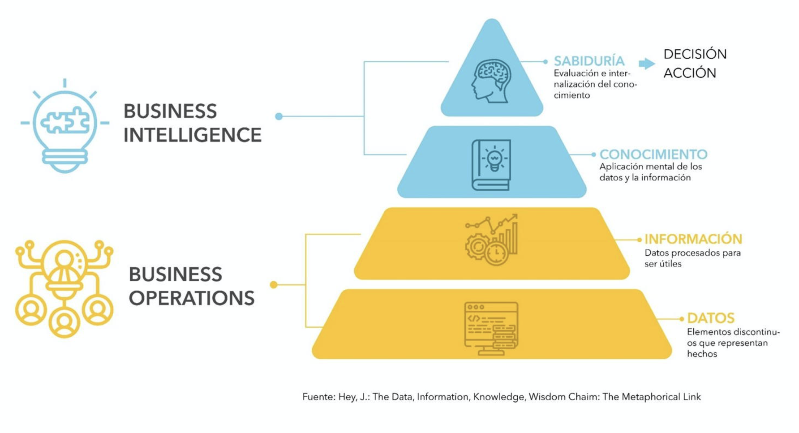
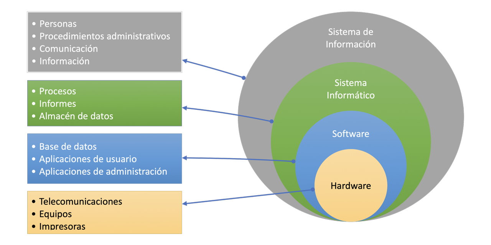
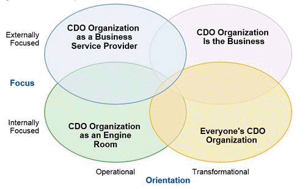
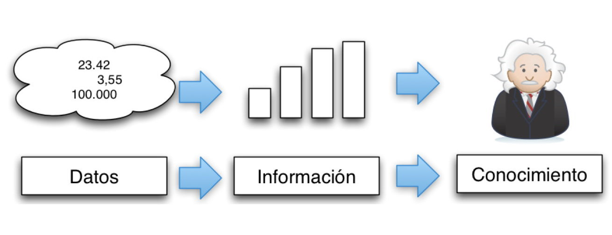
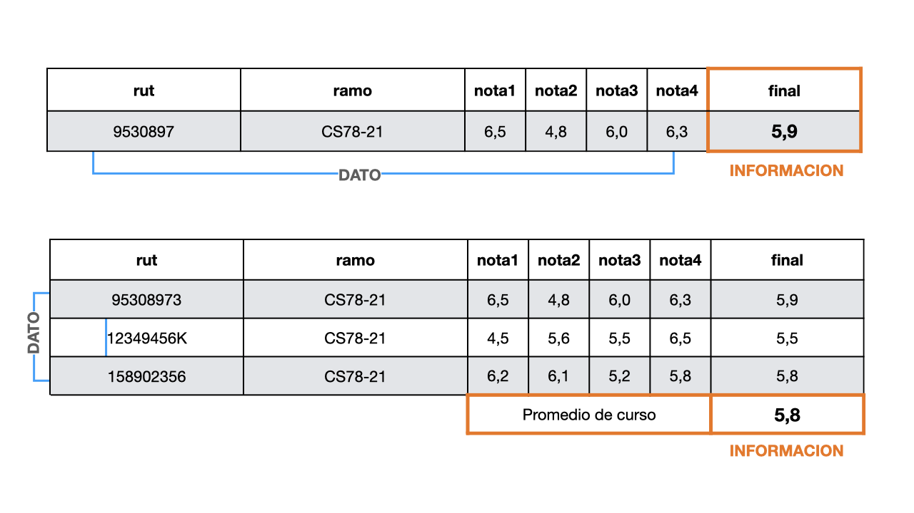

Las organizaciones de todo tipo, hace mucho tiempo que han reconocido la necesidad de almacenar datos y transformarlos en información. Esta información debe ser administrada, planificada, controlada y tratada como un activo. Este activo debe ser manipulado en forma efectiva y eficiente.

La tarea de las disciplinas de Inteligencia de Negocios (Business Intelligence), Analisis de Datos (data Analytics) y Ciencia de Datos (Data Science) es tomar unos ciertos datos y transformarlos en información para describir, pronosticar y generar conocimiento a partir de ellos. Para finalmente tomar decisiones basados en esos datos.

Sin embargo, para lograr estas metas se deben tener las capacidades de diseñar en forma correcta los datos a capturar para esa generación de conocimiento. ¿Se deben colectar todos los datos?, ¿cómo discriminar aquellos relevantes? ¿cómo muestrear adecuadamante si no dispongo del universo de datos? ¿cuando se debe efectuar métodos de imputación de datos?.



## Datos

Definamos datos como **Información concreta sobre hechos, elementos, etc., que permite estudiarlos, analizarlos o conocerlos**.

"los datos del censo; el análisis aportó datos de gran interés respecto a la génesis de esta fobia; cada ficha contiene los datos comerciales, fiscales y estadísticos de cada proveedor; estos datos configuran una densidad de población débil, aunque ello no descarta que haya núcleos muy poblados y muchas regiones vacías"

**Cifra, letra o palabra que se suministra a la computadora como entrada y la máquina almacena en un determinado formato**.

"al introducir palabras o números en una hoja de cálculo, la computadora los procesa y los almacena como datos en código binario"

Es una descripción o imagen relacionados con un hecho, evento, personas, objetos u otras entidades del mundo real. El significado del dato cambia dependiendo dentro del contexto en que se encuentre. El siguiente ejercicio es el que usualmente utilizo en mis clases para la noción del concepto de datos.

- Considere el número **25...**

- Ahora... **25 "Kilos"**

- Y ahora... **25 "kilos" de "papas"**

- Finalmente... **25 "kilos" de "papas" en "mercado" de "Concepción"**

### Contexto

La búsqueda de datos para la generación de información se da dentro de cierto ámbito dentro de toda organización. Las organizaciones de cualquier índole utilizan e intercambian información, con sus usuarios/clientes y proveedores.

 

En este nuevo contexto de alta dependencia de datos (eficientes y de calidad) se crean nuevos perfiles profesionales que suman a los ya tradicionales existentes en décadas pasadas en el ámbito del uso de tecnologías de información.

### Orígenes de datos

La importancia de los datos es clara en su objetivo de otorgar información para la toma de decisiones, las que pueden llevar a una organización al éxito o fracaso de su gestión. Ahora bien, si es tan importante los datos también lo debeira ser el orígen de donde estos son extraídos, origenes que también han evolucionado en el tiempo. Hace no mas de 10 o más años la extracción de datos proviene de bases de datos expresamente diseñadas para ello, de planillas de cálculo (Excel preferentemente) llenadas a mano por usuarios destinados a ello y por formularios tanto papel como electrónicos, que finalmente terminaban en las bases y planillas antes mencionadas.

Actualmente, se suman a las fuentes antes mencionadas un amplio número

**Bases de datos**

```sql
-- Seleccionar toda la información de clientes de Chile.
SELECT * FROM clientes WHERE pais = 'Chile'
```

**Archivos csv**

El formato más asequible para acceder a datos es a través del intercambio de archivos de texto y separados por coma. Este es formato aceptado globalmente y es el tipo de intercambio de datos preferido entre dispositivos o sistemas de información.

## Perfiles y roles profesionales

La complejidad de la obtención de datos y por tanto la complejidad de la información resultante ha llevado al desarrollo de un mayor número de perfiles especialistas, que hasta hace unos 10 años no se veían en el mercado profesional. El aumento de las fuentes de datos de todo tipo y forma, los nuevas formas de almacenamiento y de procesamiento han establecido una necesidad de mayores especialistas.

### Director de Datos (CDO)

El Director de datos (**Chief Data Officer**) [@cdo] es un nuevo rol dentro de aquellas organizaciones[^01-intro-1] con una alta especialización y valoración de los datos. Es un puente entre el área comercial estratégica y el área TI que combina capacidades tecnológicas, estadísticas y gerenciales, entre otras sus funciones son en general:

[^01-intro-1]: https://www2.deloitte.com/uy/es/pages/deloitte-analytics/articles/the-chief-data-officer.html

- Entiende los datos y las necesidades de la empresa respecto a los datos.
- Decide qué datos deben almacenarse en la base de datos.
- Establece políticas para mantener y gestionar los datos almacenados.
- Gestiona los datos como valor estratégico de la organización.
- Establece las bases para el aseguramiento de la calidad de los datos.

El conocimiento a cabalidad del área de negocios de la organización es fundamental para este perfil, ya que es quién guía a traves de todo el proceso de generación de información. Define los objetivos para la generación de valor del negocio respecto de la información y hace parte la analítica dentro del objetivo de negocio.

> El rol fundamental del CDO se enfoca en sustentar la "visión del negocio" con información.

También dentro de su área de acción se encuentra la gobernanza de los datos y el establecimiento de las políticas de uso de la información. Pasan de un rol de administrador a uno más estratégico e innovador que permite responder a los cambios tecnológicos cambiando sus ambiente de datos en la nuevas áreas de big data, automatización y aprendizaje de máquinas.

El CDO dentro de la gobernanza de datos asesora en la implementación de políticas y coordina tanto lo requisitos como el control de la información sobre los restantes actores.

<center>

</center>

La creación de un cargo de CDO generalmente va acompañada de nuevos perfile asociados dentro de una estrategia de gobierno de datos. Estos nuevos perfiles son por lo general, el dueño de los datos y el custodio de datos.

### **Dueño de los Datos (Data owner)**

El dueño de los datos dentro de la organización es un profesional interno de la organización, generalmente conocedor a un alto nivel del negocio de esta, de forma de poder establecer los datos correctos a ser utilizados y las mejoras necesarias para el crecimiento de la organización.

Sus funciones no excluyentes son regularmente:

- Precisión y exactitud de información propia
- Definir reglas de uso y coordinación de todos los datos
- Identifica errores
- Define los niveles de calidad y de seguridad de la información
- Responsable de la confidencialidad y privacidad de la información
- Establece el valor de los datos para la organización

### **Custodio de Datos (Data Steward)**

Con un aspecto más operativo que estratégico el custodio de los datos es aquél perfil que tiene entre sus responsabilidades la consistencia y accesibilidad a los datos que la organización requiere. Aparece en todas las definiciones aceptadas para este perfil (que pueden encontrarse en Internet), como un intermediario entre el Data Owner y el usuario final de los datos. Y que en organizaciones pequeñas puede estar asociadas al mismo perfil de un Data Owner.

En su nivel operativo se encarga de:

- Captura, almacena y retiene información

- Calidad y disponibilidad

- Seguridad

### Data owner vs data steward

### **Arquitecto de Datos (Data Architect - DA)**

Es tal la complejidad actual de los datos respecto de sus orígenes así como el volumen de datos que requieren ser transados, que se hace necesaria la participación de un nuevo perfil, el arquitecto de datos. Por sobre los perfiles mencionados anteriormente, es el DA el encargado de diseñar y orquestar las plataformas necesarias para el procesamiento masivo de datos para su transformación en información. Es un perfil netamente operativo encargado de construir y mantener la infraestructura de los datos de la organización.

En general el DA es el encargado de diseñar y planificar el sistema de infraeastructura de datos y es el ingeniero de datos quien la construye, sin embargo en organizaciones pequeñas estos roles son realizados por el mismo cargo. Por lo que las funciones de un ingeniero de datos, que se detalla más adelante, se pueden consignar a un DA.

Sus funciones principales abarcan:

- Diseño de modelos de datos según las reglas de negocio

- Desarrollo de bases de datos estableciendo el modelo conceptual, lógico y físico

- Determinar qué tecnologías va a usar y cómo va a hacerlo

- Crear procedimientos para garantizar la exactitud y la accesibilidad de los datos

- Seleccionar los almacenes de datos y las fuentes de los mismos

- Gestión del flujo de trabajo o workflow. Asegurarse de tener la velocidad de procesamiento y el acceso al almacenamiento para respaldarlo es esencial

- Encargado y principal responsable de que las tres fases de los [procesos ETL](https://www.inesdi.com/blog/etl-que-es-procesos-y-herramientas/) se cumplan en los tiempos establecidos y se realicen correctamente

- Auditorías de datos: Realización de informes y evaluación del trabajo de forma habitual y asegurar la integridad de los datos.

### Ingeniero de Datos (Data Engineer - DE)

El trabajo del ingeniero de datos es "la representación y el movimiento de datos para que sean consumibles y utilizables", dijo Pope. El ingeniero de datos, debe poder tomar los datos sin procesar, limpiarlos, moverlos a una base de datos, etiquetarlos y, en general, asegurarse de que estén listos para la siguiente etapa del proceso.

Con un amplio manejo de Big Data, este perfil es sumamente técnico. Los ingenieros de datos se encuentran entre los desarrolladores de aplicaciones y los científicos de datos. Se encargan de diseñar, construir y gestionar los datos y la infraestructura necesaria para almacenarlos y procesarlos. Construyen la base tecnológica para que los científicos de datos y analistas puedan realizar sus tareas. Por lo tanto, son los responsables de mantener sistemas escalables, con alta disponibilidad y rendimiento, integrando nuevas tecnologías y desarrollando el software necesario.

Deben conocer las tecnologías Big Data Apache Spark, Scala, Docker, Hadoop, HDFS y otras, y entender cómo se integran sus tecnologías y las formas de procesar, transformar y tratar los datos con herramientas de ingesta y los procesos ETL[^01-intro-2]. Además, deben saber cómo mover datos hacia y desde los sistemas de Big data y la implementación de bases de datos para grandes volumenes de datos. Entre sus funciones también se encuentra dar apoyo y facilitar el trabajo a analistas y científicos de datos, así como al negocio.

[^01-intro-2]: ETL. Procesos de extracción, transformación y carga de datos.

Como se trata de procesos complejos y muy integrados se requiere además un manejo de lenguajes de scripting y conocer procesos de automatización (mediante Python u otro lenguaje) e interacciones con APIs y fuentes de datos externas.

Por definición, el Big Data suele tener lugar en sistemas distribuidos, que es otro de los conocimientos fundamentales para un buen ingeniero de datos. Estos sistemas tienen numerosas particularidades en torno a la replicación de datos, consistencia, tolerancia a fallos, particionado y concurrencia. En este punto se englobarían tecnologías como HDFS, Hadoop o Spark.

Habilidades Fundamentales Tecnologías y servicios Cloud. La demanda de estas tecnologías no para de crecer, y es que cada vez es más frecuente iniciar proyectos de migración a la nube en las empresas. Un buen ingeniero de datos debe conocer y tener experiencia en el uso de servicios cloud, sus ventajas, desventajas y sus aplicación en proyectos Big Data. Al menos debería estar familiarizado con una plataforma como Azure o AWS ya que son las más extendidas. Además, debe conocer buenas prácticas en cuanto a seguridad de los datos y virtualización. Recuerda que estas tecnologías han venido para quedarse e invertir tiempo en formarse es siempre una buena idea.

Los Ingenieros de Datos también deben conocer el funcionamiento y uso de las bases de datos. También las diferencias que existen entre bases de datos relacionales y NoSQL. El lenguaje básico para interactuar con estas bases de datos es SQL, por lo que también debe estar familiarizado con escribir consultas de lectura y manipulación de datos. Además, debe entender la diferencia entre los tipos de bases de datos NoSQL y los casos de uso para cada uno de ellos.

Uno de los roles principales de los ingenieros de datos es crear pipelines de datos con tecnologías ETL y frameworks de orquestación. En esta sección podríamos enumerar muchas tecnologías pero el ingeniero de datos debería conocer o sentirse cómodo con algunas de las más conocidas como puede ser [NiFi](https://nifi.apache.org/) o [Airflow](https://airflow.apache.org/).

Las actividades esenciales para este perfil profesional son entre otras y mezcladas habitualmente con las del DA:

- Diseño de modelos de datos

- Desarrollo de bases de datos

- Tecnologías Big Data

- Seleccionar los almacenes de datos y las fuentes de los mismos

- Gestión del flujo de trabajo (workflow). Asegurarse de tener la velocidad de procesamiento y el acceso al almacenamiento para respaldarlo es esencial

- Responsabilidad sobre las tres fases de los [procesos ETL](https://www.inesdi.com/blog/etl-que-es-procesos-y-herramientas/) se cumplan en los tiempos establecidos y se realicen correctamente

- Auditorías de datos: realización de informes y evaluación del trabajo de forma habitual

- Manejo de herramientas de gestión: Apache Spark, Hadoop, Airflow, etc.

### Analista de Datos (Data Analyst)

Este perfil profesional esta abocado a la recopilación y transformación de datos para la toma de decisiones empresariales. Para ello se vale del uso de estadística y de herramientas de gestión de datos para presentar hechos y respuestas a preguntas del negocio. Las habilidades de comunicación son relevantes para este perfil junto al conocimiento del negocio, ya que debe informar y explicar la información obtenida para la toma de decisiones.

Responde a preguntas tales como ¿cuántas ventas se realizaron este mes? ¿cuáles han sido los productos más solicitados y donde?, ¿cuál es la proyección de ingresos para 2024?, ¿qué volumen de contactos se ha transformado en ventas?, ¿qué modelo de ventas ha sido más exitoso?.

Este perfil profesional posee una alta capacidad para la gestión de captura de datos y la generarción de procesos de transformación de datos, con conocimientos de uso de bases de datos, captura de datos mediante SQL y Excel, y el uso de herramientas de programación como Python y R entre otras.

La herramienta más poderosa de un analista es un gestor de reportes, del tipo [Power BI](https://powerbi.microsoft.com/es-es/desktop/) o [Tableau](https://www.tableau.com/es-mx) (entre otros), que permite realizar todo tipo de informes o completos paneles de información, orientados a comunicar de forma efectiva los resultados con el fin de la toma de decisiones.

Las actividades fundamentales o capacidades de este tipo de perfil son:

- Preprocesamiento de datos

- Análisis exploratorio

- Estadística descriptiva e inferencial

- Visualización de datos

- Comunicación de resultados, siendo esta tal vez la función más relevante para los fines de la organización

### Científico de Datos (Data Scientist)

A diferencia de un analista de datos un científico de datos está orientado a resolver problemas del tipo de descubrimiento de patrones. Para lo cual se vale de herramientas de programación, estadística probabilística y técnicas de aprendizaje automático.

No es el volumen de datos lo que distingue a un analista de un científico (de datos) sino el objetivo a cumplir con esos datos. El analista presenta el estado actual y posiblemente la proyección simple (inferencia) de lo que puede ocurrir en un futuro cercano. En tanto, el científico de datos debe realizar descubrimiento de patrones, plantear hipótesis y verificarlas (uso del método científico).

### Administrador de Base de datos (DBA)

El DBA (Data Base Administrator) es el profesional informático encargado de la administración de una o varias bases de datos gestionando su uso y funcionamiento. Es responsable por el diseño de la base de datos y la gestión de ella, fijando normas que resguardan tanto la seguridad como la integridad de ellas.

Este perfil es netamente operativo a cargo de la infraestructura directa asociada a las bases de datos de la organización. Siendo el responsable de la mantención de la estructura y las políticas de seguridad de las bases. Es este perfil el gestiona además los roles de acceso y permisos asociados a los usuarios de la organización definidos por el DA y/o el DO.

Este perfil es, en última instancia el encargado de la creación, edición de las bases de datos y su estructura. También de la construcción de los procedimientos y funciones requeridos para su funcionamiento.

**Funciones**

- Crea la base de datos.
- Implementa los controles necesarios para que se respeten las políticas establecidas por el administrador de datos.
- Es el responsable de garantizar que el sistema obtenga las prestaciones deseadas. Presta servicios técnicos.
- Mantener la base de datos disponible y actualizada.
- Realizar los respaldos de seguridad. Define políticas de seguridad y de respaldo.
- Disponer del accesos a los datos desde las aplicaciones.
- Mantener la seguridad de los datos.
- Diseñar y administrar la estructura de los datos.
- Monitorear la actividad de los datos.
- Se asegura de que la comunicación del sistema con la base de datos sea expedita.

Los Administradores de Bases de Datos son responsables del manejo, mantenimiento, desempeño y de la confiabilidad de bases de datos. Asimismo, están a cargo de la mejora y diseño de nuevos modelos de las mismas. Manejar una base de datos implica recolectar, clasificar y resguardar la información de manera organizada, por ello, estos profesionales velan por garantizar que la misma esté debidamente almacenada y segura, además de que sea de fácil acceso cuando sea necesario.

### Desarrollador de Base de Datos

Personas como analistas de sistemas y programadores que diseñan nuevos programas de aplicación para los usuarios finales.

Los programadores de sistemas informáticos escriben programas para controlar el funcionamiento interno de los ordenadores, lo que implica diseñar programas que sean eficientes, rápidos y versátiles. Dedican mucho tiempo a probar los programas, y también puede instalar, personalizar y dar soporte a estos sistemas operativos.

El profesional que debiera asumir este rol es:

- Ingeniero en informática
- Programador
- Analista programador

### Usuario final

Los usuarios finales son las personas que utilizan los datos para su trabajo cotidiano y no son necesariamente del área de la informática. Normalmente no utilizan la base de datos directamente, sino aplicaciones creadas para ellos a fin de facilitar la manipulación de los datos. Estos usuarios sólo acceden a ciertos datos del total.

Si bien el usuario final es el receptor de lso datos/información preparada por los perfiles antes mencionados, también en su actividad diaria pueden generar necesidades para la toma de nuevos y/o mejorados datos para cumplimentar sus funciones.

## La información

Información son datos que han sido organizados o preparados en una forma adecuada para apoyar la toma de decisiones: Por ejemplo una lista de productos y su stock sin ningún orden son datos, pero un lista de productos ordenados por stock (de menor a mayor) representa información para el encargado de compras de un supermercado.



## Discusión

¿Puede en un momento dado un objeto considerarse como dato y en otro momento como información? ¿Por qué?

 ¿Es capaz de presentarse a sí mismo sin entregar información si no solo datos?