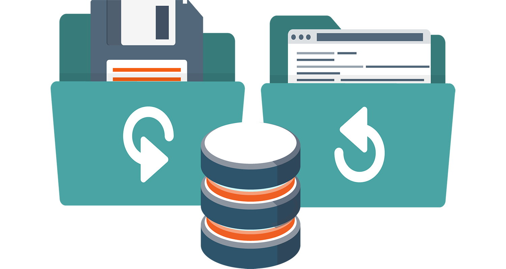

El almacenamiento de datos es y ha sido relevante desde siempre, antes de la era informática los datos eran capturados y almacenados en documentos y planillas de todo tipo. Luego, se almacenan por excelencia en planillas digitales (recordarán Excel, Lotus y Multiplan)[^02-database-1], donde el problema siempre ha sido el mismo, cómo asegurar el ingreso de información correcta y cómo estructurar la información.

[^02-database-1]: Este es un guiño para los que tenemos más de 50 años.

Siempre se ha intentado recopilar los datos en forma ordenada y sistemática de forma que este almacenamiento contribuya a la extracción de infomación relevante.

## Archivos

En el enfoque de archivos tradicionales (documentos) los datos se almacenan en archivos individuales, exclusivos para cada aplicación particular.

Hoy en día los documentos tradicionales para el almacenamiento de datos es la planilla de Microsoft Excel y su competidor más cercano Google Sheet. Muchos departamentos dentro de organizaciones usan estos archivos para la carga de datos, la razón sigue siendo su simplicidad y rápidez para ingresar datos, para usuarios no necesariamente especialistas en TI.

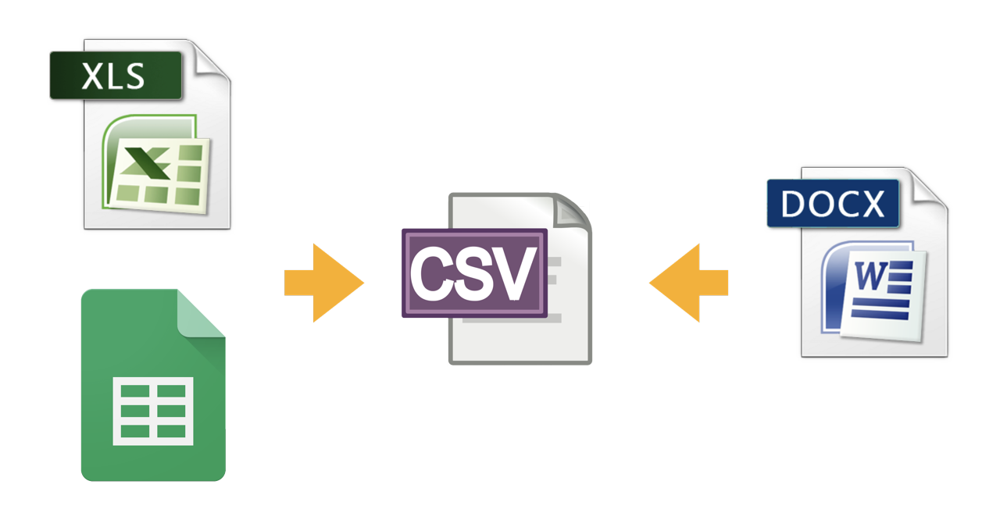

La información en estas planillas se ingresa en forma tabular con conceptos de fila y columnas que se han agregado también a su uso en las bases de datos.

Es muy fácil ingresar datos en estas planillas de datos y luego cargar esta información para análisis en programas de análisis o en bases de datos especializadas. Generalmente debe exportarse estos datos en un formato más simple denominado CSV ("comma separated value").

En estas planillas los datos pueden ser una alta fuente de error y la actualización de los archivos es más lenta que en una base de datos. Los problemas de utilización de estas planillas se resumen en (solo una muestra):

- **redundancia**
  Al no existir algún tipo de control sobre el ingreso más que el del usuario, es muy normal que existan este tipo de errores de duplicidad en los registros.

- **error de ingreso**
  Errores comunes en el ingreso manual de datos, errores de tipo ortográfico, números mal ingresados, etc.

- **estandarización**  Es el tipo de error más común y se ejemplifica en el ingreso de fechas donde a pesar de poder regir el formato de entrada, no impide que se ingrese otros formatos que si bien pueden ser correctos, interfieren en la foma de incluirse en una base de datos. (21-12-2021 o bien 21/02/2021, o 21/2/2021).

- **seguridad**
  No hay un control de uso y acceso por usuarios a los datos, más que el control al archivo físico en el computador local o servidor.

### Planillas de Datos

Una mención especial debe hacerse al respecto del uso de planillas electrónicas como almacén de datos. Si bien presentan las desventajas antes descritas, también permiten en forma fácil realizar un ingreso de datos masivo y simple. Y las principales aplicaciones (Microsoft Excel y Google Sheet) agregan herramientas de análisis para este tipo de documento.

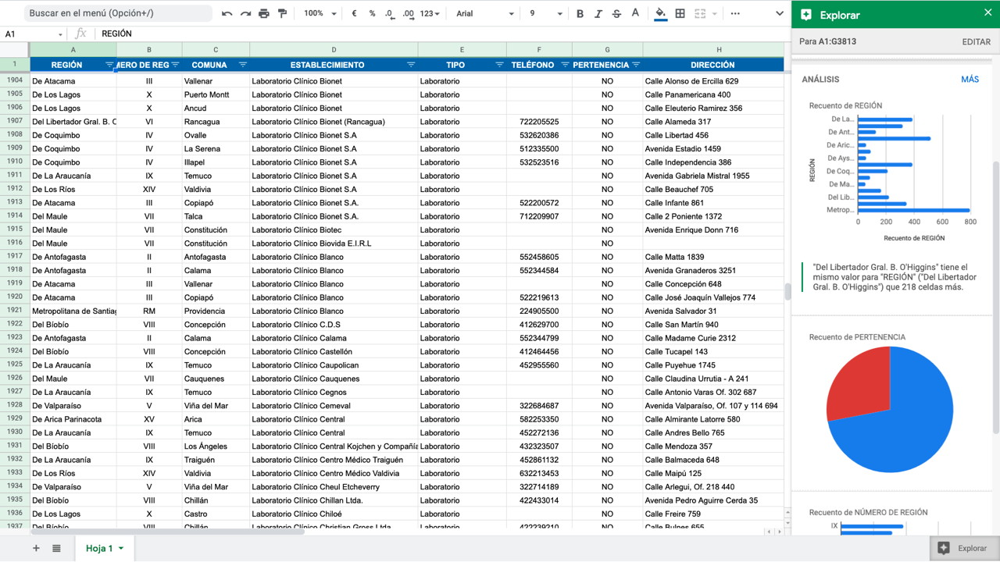

Sin embargo, no debe confundirse este tipo de documentos con bases de datos como suele hacerse. Una planilla **no es una base de datos**. Contiene datos efectivamente pero constituye un repositorio de datos.

## Enfoque de Base de Datos

Gran parte de los errores mencionados anteriormente puden ser evitados utilizando una base de datos para la captura y almacenamiento de datos. Para lograr un efectivo tratamiento del recurso dato las organizaciones han optado por trabajar con Bases de Datos que permiten tener un conjunto de datos relacionados y almacenados en forma permanente y usados con variados propósitos por múltiples usuario y que permiten:

- **Integrar**: significa que los diferentes archivos de datos han sido lógicamente organizados para reducir la redundancia de datos y facilitar el acceso a ellos.

- **Compartir**: significa que todos los usuarios calificados tienen acceso a los mismos datos, para usarlos en diferentes actividades.

En una Base de Datos este conjunto de datos relacionados (actualmente también incluye procedimientos y funciones que operan sobre esos datos) son almacenados en forma permanente y usados con variados propósitos por múltiples usuarios.

En forma de síntesis se puede definir una base de datos como

## Elementos

### Personal

**Desarrolladores de Sistemas o Aplicaciones**: personas como analistas de sistemas y programadores que diseñan nuevos programas de aplicación.

**Administradores de Base de Datos**: profesional responsables por el diseño de la base de datos y por fijar normas que resguardan la seguridad e integridad de ella.

**Usuarios Finales**: personas de la organización que agregan, borran y modifican datos en la base de datos y que consultan o reciben información desde la base de datos.

### Operacionales

**Sistema Administrador de Base de Datos**: El SGBD o DBMS es un software (conjunto de programas) que permite manejar una o más Bases de Datos que facilita el proceso de definir, construir y manipular Bases de Datos. Sus principales funciones son: Definición de Datos (se puede realizar a través del lenguaje de definición de datos o DDL) que provee el DBMS.

**Manipulación de Datos**: permite almacenar, modificar y recuperar los datos de la Base de Datos. Esto se logra a través del lenguaje de manipulación de datos o DML provisto por el SGBD.

**Seguridad de Datos**: el SGBD provee de mecanismos para controlar el acceso y para definir qué operaciones puede realizar cada usuario. Además, debe proveer de mecanismos de respaldo y recuperación de la Base de Datos, También debe manejar el acceso concurrente a la Base de Datos.

**Base de Datos**: Es el lugar físico donde quedan los datos de un usuario. Puede ser una Base de Datos Centralizada (completamente almacenada en un computador central) o una Base de Datos Distribuida (donde los datos están almacenados en distintos nodos de una red).

**Repositorio**: Lugar donde quedan las definiciones de los datos, formatos de pantallas, reportes y definiciones de otros sistemas de la organización. Se le conoce también con el nombre de Diccionario de Datos.

**Interface Usuarios/Sistema**: Consiste de lenguajes o paquetes generadores de interfaces, reportes, etc. que permiten a los usuarios interactuar con la Base de Datos.

**Programa de Aplicaciones**: Programas computacionales usados para crear y mantener las Base de Datos, además para proveer información a los usuarios.

**Herramientas CASE (Computer-Aided Software Engineering)**: En un nivel más alto estas son herramientas automatizadas que apoyan el desarrollo de software, especialmente en lo que respecta al diseño de la Base de Datos y sus programas de aplicación.

## Sistemas Gestores de Bases de Datos

Las principales funciones del Sistema Gestor de Bases de datos SGBD (en inglés Database Management System, "DBMS" o también Relational Database management System, "RDBMS", se aplicará ene ste libro DBMS en forma indistinta) son:

Definición de Datos: (se puede realizar a través del lenguaje de definición de datos o DDL) que provee el DBMS.

Manipulación de Datos: permite almacenar, modificar y recuperar los datos de la Base de Datos. Esto se logra a través del lenguaje de manipulación de datos o DML provisto por el DBMS

Seguridad de Datos: el DBMS provee de mecanismos para controlar el acceso y para definir qué operaciones puede realizar cada usuario. Además, debe proveer de mecanismos de respaldo y recuperación de la Base de Datos, También debe manejar el acceso concurrente a la Base de Datos.

### Funciones Generales

- Permitir a los usuarios almacenar datos, acceder a ellos y actualizarlos, ocultando su estructura física.
- Proporcionar un catálogo (diccionario de datos) accesible por los usuarios.
- Proporcionar un mecanismo que garantice el procesamiento de las transacciones.
- Proporcionar un mecanismo que realice el control de la concurrencia.
- Proporcionar un mecanismo para recuperación ante fallos.
- Proporcionar un mecanismo de seguridad.
- Integrarse con algún software de comunicación.
- Encargarse de mantener las reglas de integridad.
- Encargarse de mantener la independencia entre los programas y la estructura de la base de datos.
- Proporcionar herramientas para administrar la base de datos.

### Componentes

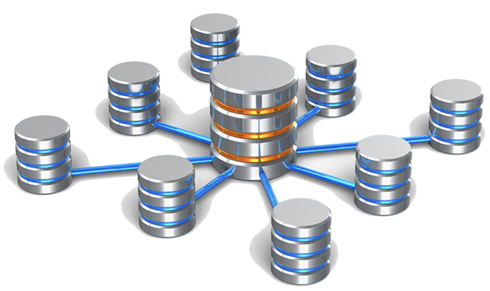

#### El procesador de consultas

Es el componente principal de un SGBD. Transforma las consultas en un conjunto de instrucciones de bajo nivel que se dirigen al gestor de la base de datos.

#### El gestor de la base de datos

Es la interface con los programas de aplicación y las consultas de los usuarios. El gestor de la base de datos acepta consultas y examina los esquemas externo y conceptual para determinar qué registros se requieren para satisfacer la petición. Entonces el gestor de la base de datos realiza una llamada al gestor de archivos para ejecutar la petición.

#### El gestor de archivos

El gestor de archivos o motor de almacenamiento (storage-engine) maneja los archivos en disco en donde se almacena la base de datos y se encarga de almacenar, manejar y recuperar la información contenida en una tabla. Este gestor establece y mantiene la lista de estructuras e índices definidos en el esquema interno. Si se utilizan archivos dispersos, llama a la función de dispersión para generar la dirección de los registros. Pero el gestor de archivos no realiza directamente la entrada y salida de datos. Lo que hace es pasar la petición a los métodos de acceso del sistema operativo que se encargan de leer o escribir los datos en el buffer del Sistema. Sin embargo los hay que gestionan en forma autónoma los archivos relacionados con la base de datos. La gestión de archivos es dependiente del tipo de motor de base de datos que se utilice.La gestión de archivos es dependiente del tipo de motor de base de datos que se utilice.

https://wiki.postgresql.org/wiki/Future_of_storage

##### MyISAM

En MySQL si se utiliza el que esta por defecto **MyISAM**, cada tabla se almacena en tres (3) archivos distintos (.frm .MYD .MYI). Esta permite una mayor velocidad al recuperar la información de las tablas por lo que se utiliza en aplicaciones donde predomina la lectura mediante el uso de "SELECT" que las escrituras mediante UPDATE o INSERT. No realiza comprobaciones de integridad referencial ni ejecuta bloqueo de filas pero si de tablas. Por ello no admite transacciones.

##### InnoDB

Por otro lado si se requieren características ACID, soportar transacciones y el bloqueo de registros se utiliza el modelo **InnoDB** para el almacenamiento. Este es el indicado para aplicaciones con preponderancia de escrituras con INSERT o UPDATE.

InnoDB permite un almacenamiento transaccional con capacidad de confirmación (COMMIT) y de cancelación (ROLLBACK) además de recuperación ante fallos. También efectúa bloqueos a nivel de filas.

##### Memory

Crea tablas en memoria por lo que es bastante rápido. No admite transacciones y se utiliza para crear tablas temporales y busquedas rápidas. Como esta basado en memoria los datos se pierden al reiniciar la base de datos.

##### ASM

Oracle utiliza un sistema de gestión de archivos más compleja denominado Automatic Storage Management (ASM)[^02-database-3] pero que facilita la administración. Implementa archivos para diversas funciones (archivos de control, de datos, de parámetro, de contraseñas, de recuperación, de recuperación en línea, de archivado de recuperación en línea, y registros de alertas y archivos de seguimiento) y un gestor ASM que organiza todos los archivos y discos para que trabajen como una sola entidad.

<figure>
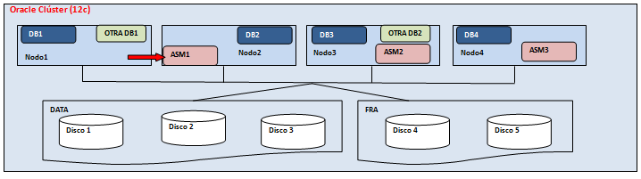
<figcaption>Modelo Flex ASM de Oracle</figcaption>
</figure>

En el caso que una instancia ASM del clúster falla, Oracle 'Clusterware' inicia una instancia de ASM en sustitución en un nodo diferente del clúster para mantener "ASM Cardinality", representa un modelo de "failover" de instancias ASM.

https://www.oracle.com/technetwork/es/articles/database-performance/oracle-database1c-flex-asm-2103603-esa.html

#### El preprocesador del LMD

Lenguaje de Manejo de Datos (LMD). Convierte las sentencias del LMD embebidas en los programas de aplicación, en llamadas a funciones estándar escritas en el lenguaje anfitrión. El preprocesador del LMD debe trabajar con el procesador de consultas para generar el código apropiado.

#### El compilador del LDD

Lenguaje de Definición de Datos (LDD) convierte las sentencias del LDD en un conjunto de tablas que contienen metadatos. Estas tablas se almacenan en el diccionario de datos. El DDL sirve para definir estructuras de almacenamiento.

Convierte las sentencias DDL en archivos físicos que almacenan la estructura lógica, esto es, la información acerca de los datos que se almacenaran. Tipos de datos, atributos de las tablas, restricciones y la relación con otras tablas.

#### Diccionario de datos

Contiene la información referente a la estructura de la base de datos. El gestor del diccionario controla los accesos al diccionario de datos y se encarga de mantenerlo. La mayoría de los componentes del SGBD acceden al diccionario de datos.

## Ventajas

Algunas de las ventajas del uso de sistemas de bases de datos:

**Mínima Redundancia de Datos**: Al integrar los datos en una sola estructura lógica y almacenando cada ocurrencia de un ítem de dato en un solo lugar de la Base de Datos, se reduce la redundancia.

**Consistencia de Datos**: Al controlar la redundancia de datos, se reduce enormemente la inconsistencia, dado que al almacenarse un dato en un solo lugar, las actualizaciones no producen inconsistencia.

**Integración de Datos**: En una Base de Datos, los datos son organizados de una manera lógica que permite definir los relacionamientos entre ellos.

**Compartir Datos**: Una Base de Datos es creada para ser compartida por todos los usuarios que requieran de sus datos; muchos sistemas de Base de Datos permiten a múltiples usuarios compartir la Base de Datos en forma concurrente, aunque bajo ciertas restricciones.

**Esfuerzo por Estandarización**: Establecer la función de Administración de Datos es una parte importante de este enfoque, su objetivo es tener la autoridad para definir y fijar los estándares de los datos, así como también posteriores cambios de estándares.

**Facilitar el Desarrollo de Aplicaciones**: Este enfoque reduce el costo y tiempo para desarrollar nuevas aplicaciones.

**Controles de Seguridad, Privacidad e Integridad**: El control centralizado que se ejerce bajo este enfoque, a través de la función Administración de Base de Datos, puede mejorar la protección de datos en comparación con archivos tradicionales Flexibilidad en el acceso: Este enfoque provee múltiples formas de recuperación de cada ítem de dato, permitiendo a un usuario mayor flexibilidad para ubicar datos que en archivos tradicionales.

**Independencia de los Datos**: Permite cambiar la organización de los datos sin necesidad de alterar los programas. Es uno de los objetivos principales del enfoque de Base de Datos.

**Reducción de la Mantención de Programas**: Como los datos son independientes de los programas se reduce la necesidad de modificar (mantener) los programas aún cuando existan una modificación constantes de éstos.

## Desventajas

**Personal Especializado**: Generalmente se necesita contratar o capacitar a personas para convertir sistemas existentes, desarrollar y estimar nuevos estándares de programación, diseñar Bases de Datos y administrarlas.

**Necesidad de Respaldos**: Al tener mínima redundancia se requiere contar con respaldos independientes que ayuden a recuperar archivos dañados, los DBMS generalmente proveen de herramientas que permiten respaldar y recuperar archivos.

**Problemas al compartir Datos**: El acceso concurrente a los datos puede causar datos no consistentes o bloqueo de datos (deadlock). Los DBMS deben ser diseñados para prevenir o detectar tales interferencias, de una forma que sea transparente para el usuario.

**Conflicto Organizacional**: El mantener los datos en una Base de Datos para ser compartidos, requiere de un consenso en la definición y propiedad de los datos como también en la responsabilidad por la exactitud de ellos.

## ACID

En bases de datos se utiliza el termino **ACID** para definir a aquellas que cumplen ciertas características en sus transacciones. Una **transacción** es una serie de procesos que se aplican dentro de una base de datos en forma secuencial u ordinal y que debe realizarse de una vez y sin alterar la estructura de los datos.

Una base de datos es cumplimentaria ACID si presenta estas cuatro propiedades dentro de las transacciones de una BD:

**Atomicidad**

Referida a la propiedad que determina que la operación se haya realizado o no, pero nunca a medias. Se ejecuta la operación completa con todos sus pasos o no se ejecuta del todo.

**Consistencia**

Solo se ejecutan las operaciones que no afectan la integridad de la base de datos. Cualquier operación que se lleva a cabo será de un estado válido a otro con datos consistentes.

**Aislamiento**

(Isolation) Cada operación es única y no afecta a otras aunque se realicen sobre la misma información.

**Durabilidad**

Asegura que la operación una vez realizada, es persistente y no se podrá deshacer a pesar de fallos en el sistema.

## Teorema CAP

<figure>
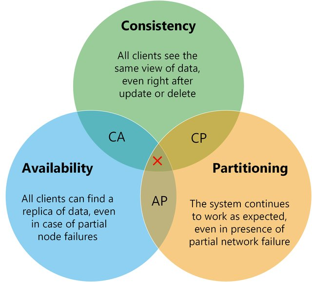
<figcaption>Teorema CAP, nunca se cumplen todas las condiciones.</figcaption>
</figure>

El teorema CAP establece algunos atributos deseados en todo gestor de base de datos que nos permita manejar los datos con cierta seguridad y confianza en ellos. Son tres características que los motores de bases de datos tratan de equilibrar, en el sentido que algunos poseen mayor fortaleza en alguno de los tres términos involucrados; **consistencia** (Consistency), **disponibilidad** (Availability), **tolerancia** a particiones (Partitioning tolerancy).

Esta regla acuñada por [Eric Brewer](https://es.wikipedia.org/wiki/Eric_Brewer_(cient%C3%ADfico)) durante un simposio de computación distribuida en el año 2000.

### C- Consistencia

Esta propiedad esta referida a la lectura coherente del valor de un dato desde cualquier instancia y/o cliente. Esto es, que el valor no cambia, y en un sistema distribuido este se encuentra replicados y sincronizado en todos los nodos.

### A- Disponibilidad

Acceso a los datos en forma ininterrumpida de forma rápida y válida. Los datos esta siempre disponibles.

### P- Tolerancia a particiones

Capacidad de estabilidad y continuidad a pesar de interrupciones en la comunicación.

Por regla general las bases de datos pueden garantizar solo dos de los tres atributos lo que origina las siguientes combinaciones:

**CA: *Consistencia y Disponibilidad***

Se garantiza el acceso a la información y el valor del dato es consistente (igual) para todas las peticiones atendidas; de haber cambios, se mostrarán inmediatamente. Sin embargo, la partición de los nodos no es tolerada por el sistema de forma simultánea.

**AP: *Disponibilidad y Tolerancia a la partición***

Se garantiza el acceso a los datos y el sistema es capaz de tolerar (gestionar) la partición de los nodos, pero dejando en segundo plano la consistencia de los datos, ya que no se conserva y el valor de dato no estará replicado en los diferentes nodos al instante.

Las bases que adotan este modelo son principalmente aquellas construidas para manejar un gran volumen de datos en entornos distribuidos, con múltiples nodos de datos interconectados entre sí.

**CP: *Consistencia y Tolerancia a la partición***

Se garantiza la consistencia de los datos entre los diferentes nodos y la partición de los nodos se tolera, pero sacrificando la disponibilidad de los datos, con lo cual, el sistema puede fallar o tardar en ofrecer una respuesta a la petición del usuario.

La elección de la base adecuada está en directa relación con lo que el negocio puede aceptar respecto de los datos administrados. Un ejemplo son los bancos donde prevalece el modelo **CP**, esto es, que la información debe ser siempre consistente y no admitir fallos, y dejando la disponinbilidad en segundo plano. Podemos permitir estar si acceso a los datos por un tiempo (caso de falla), pero estos datos no pueden verse alterados de ninguna manera.

Lo anterior tambien aplicará en el entorno sanitario donde se requiere alta seguridad de los datos administrados por sobre la disponibilidad (¿cuantas veces ha oído que se ha caído el sistema?).

## PostgreSQL

PostgreSQL es un motor de base relacional

Se verá en mayor detalle en el capítulo 11.

https://www.postgresql.org/

### PgAdmin4

Es el editor y herramienta de desarrollo más utilizado para PostgreSQL.

pgAdmin 4 es una reescritura completa de pgAdmin, construida con Python y Javascript/jQuery. Es un entorno de ejecución de escritorio escrito en NWjs permite que se ejecute de forma independiente para los usuarios individuales, el código de la aplicación web puede ser desplegado directamente en un servidor web para su uso por uno o más usuarios a través de su navegador web.

https://www.pgadmin.org

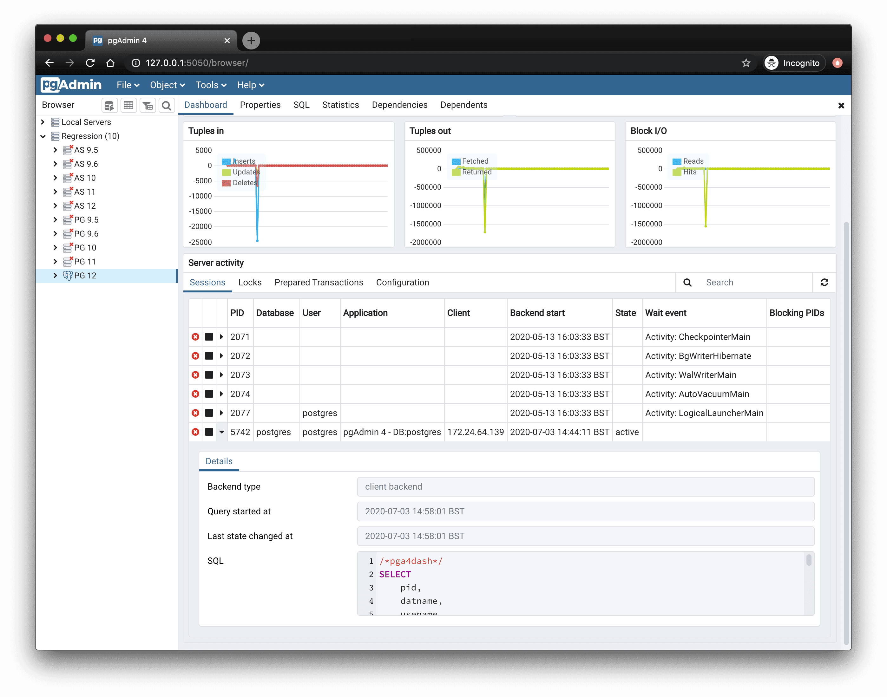

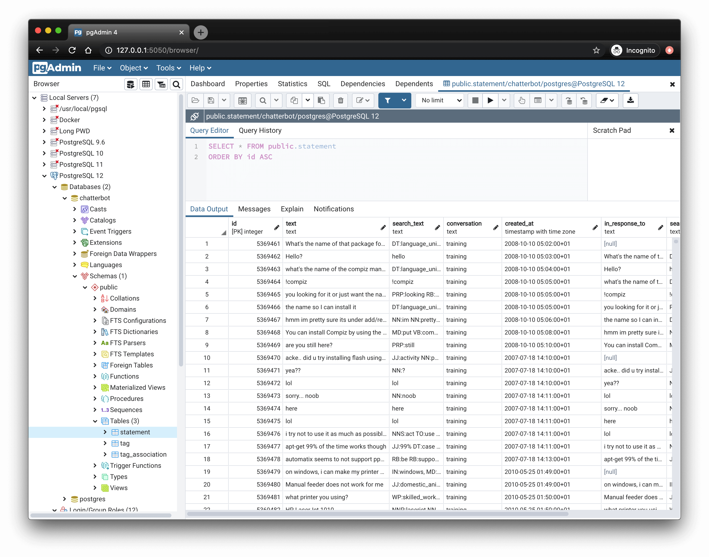

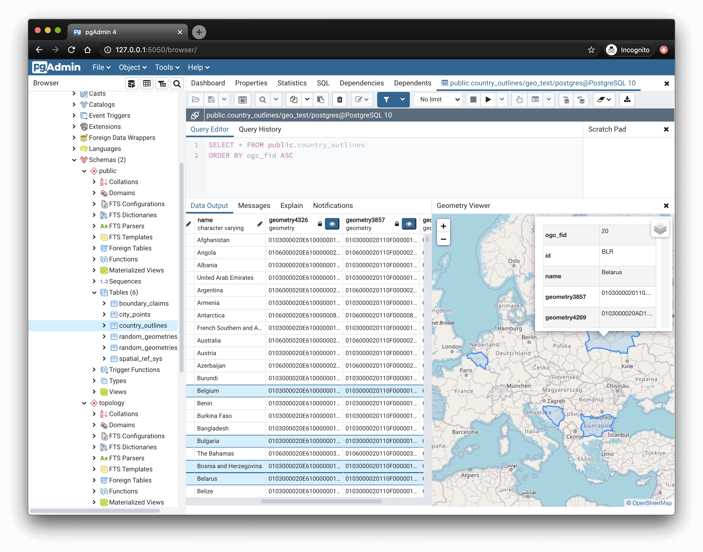

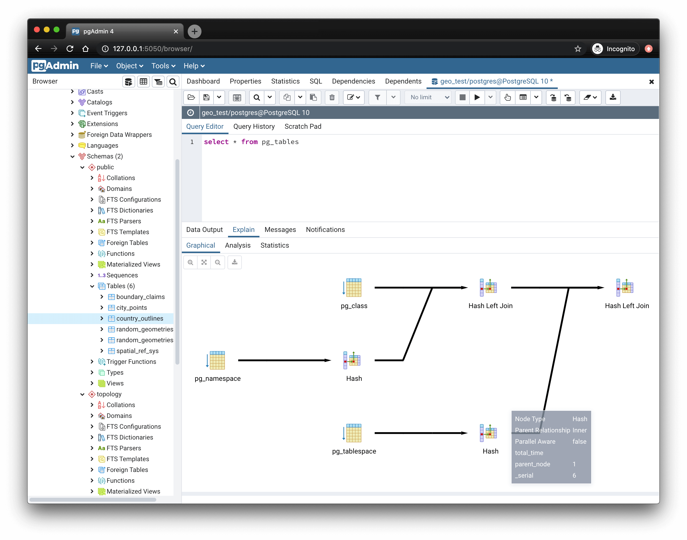

### DBeaver

Herramienta gratuita de bases de datos multiplataforma para desarrolladores, administradores de bases de datos, analistas y todas las personas que necesiten trabajar con bases de datos. Soporta todas las bases de datos populares: MySQL, PostgreSQL, SQLite, Oracle, DB2, SQL Server, Sybase, MS Access, Teradata, Firebird, Apache Hive, Phoenix, Presto, etc.

https://dbeaver.io

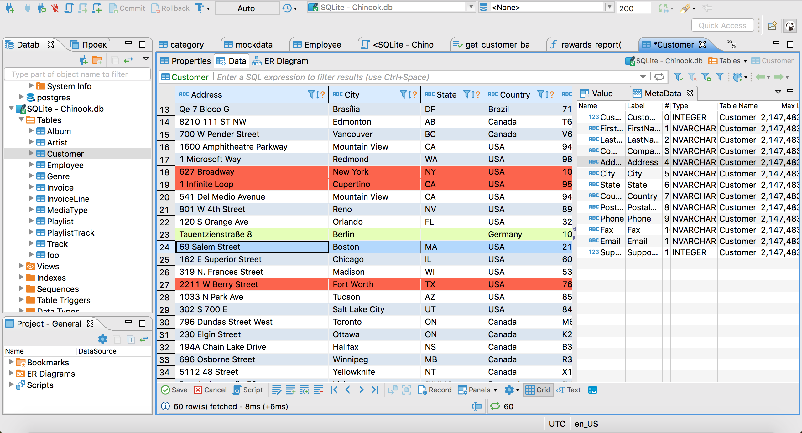

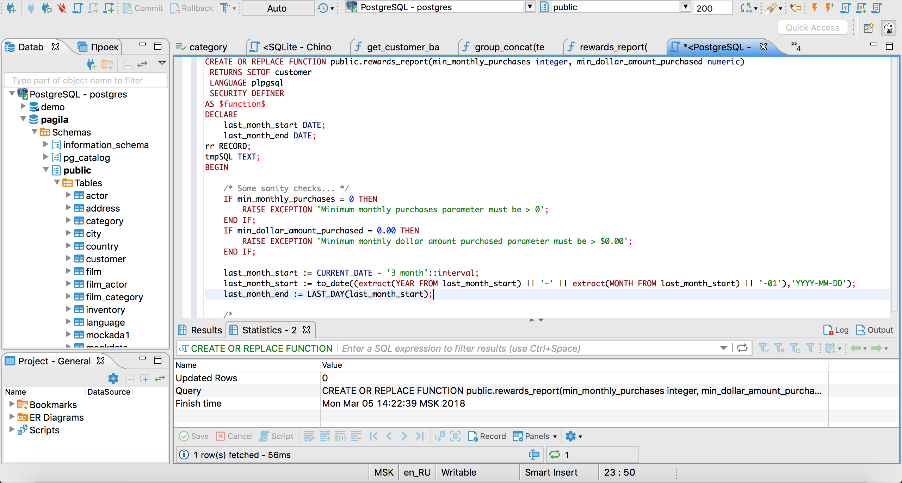

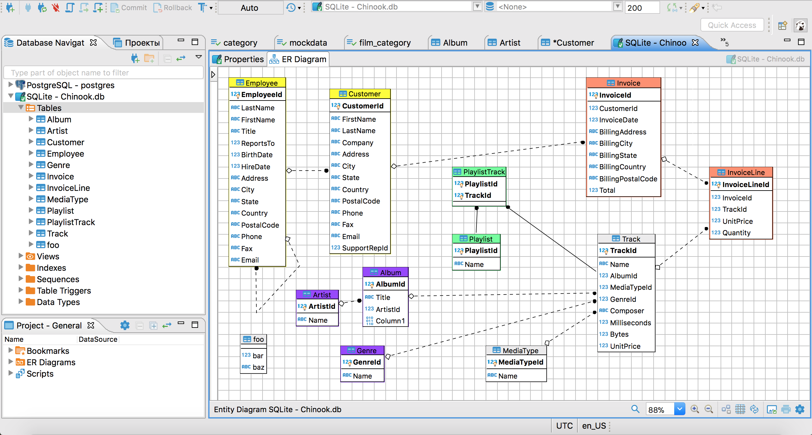

## Mongodb

MongoDB es una base de datos distribuida, basada en documentos y de uso general que ha sido diseñada para desarrolladores de aplicaciones modernas y para la era de la nube. Es una [**base de datos**](https://www.google.com/search?q=base+de+datos&sca_esv=046dc2c9c0fa6748&rlz=1C5CHFA_enCL855CL855&sxsrf=AE3TifMbvBpBaKYzhLr8GDhMyJuAWRwsTQ%3A1758160829242&ei=vWfLaJbJDryj1sQPmLLXuQQ&mstk=AUtExfBpXPBPJh4Hsm1YWj7aMIJ1QSKk-thddBobhuEE89vWqAzMrAy3nxf4at1I9-mXAnvNTfJk3EXWfYxseDaApSHukwjGM_C8gF_ohRI-Tf93J7i528dV0zqackJN4F-wIOnOFj5gXHSCZBRLIqYeUWNbwNaUN0iegT50qALFyrsNA1g&csui=3&ved=2ahUKEwj17arCm-GPAxXar5UCHXtpIacQgK4QegQIARAC) [**NoSQL**](https://www.google.com/search?q=NoSQL&sca_esv=046dc2c9c0fa6748&rlz=1C5CHFA_enCL855CL855&sxsrf=AE3TifMbvBpBaKYzhLr8GDhMyJuAWRwsTQ%3A1758160829242&ei=vWfLaJbJDryj1sQPmLLXuQQ&mstk=AUtExfBpXPBPJh4Hsm1YWj7aMIJ1QSKk-thddBobhuEE89vWqAzMrAy3nxf4at1I9-mXAnvNTfJk3EXWfYxseDaApSHukwjGM_C8gF_ohRI-Tf93J7i528dV0zqackJN4F-wIOnOFj5gXHSCZBRLIqYeUWNbwNaUN0iegT50qALFyrsNA1g&csui=3&ved=2ahUKEwj17arCm-GPAxXar5UCHXtpIacQgK4QegQIARAD) **y de [código abierto](https://www.google.com/search?q=c%C3%B3digo+abierto&sca_esv=046dc2c9c0fa6748&rlz=1C5CHFA_enCL855CL855&sxsrf=AE3TifMbvBpBaKYzhLr8GDhMyJuAWRwsTQ%3A1758160829242&ei=vWfLaJbJDryj1sQPmLLXuQQ&mstk=AUtExfBpXPBPJh4Hsm1YWj7aMIJ1QSKk-thddBobhuEE89vWqAzMrAy3nxf4at1I9-mXAnvNTfJk3EXWfYxseDaApSHukwjGM_C8gF_ohRI-Tf93J7i528dV0zqackJN4F-wIOnOFj5gXHSCZBRLIqYeUWNbwNaUN0iegT50qALFyrsNA1g&csui=3&ved=2ahUKEwj17arCm-GPAxXar5UCHXtpIacQgK4QegQIARAE)** que almacena datos en documentos flexibles similares a JSON, en lugar de tablas y filas como las bases de datos relacionales tradicionales. Es muy valorada por su flexibilidad, escalabilidad y facilidad de desarrollo de aplicaciones, permitiendo almacenar y procesar datos estructurados, semiestructurados y no estructurados.

Al ser una base de datos documental, lo que significa es que almacena datos en forma de documentos tipo JSON. Esta es la forma más natural de concebir los datos; frente al tradicional modelo de filas y columnas, esta es mucho más expresiva y potente.

https://www.mongodb.com/try/download/community

https://www.mongodb.com/es/developer-tools