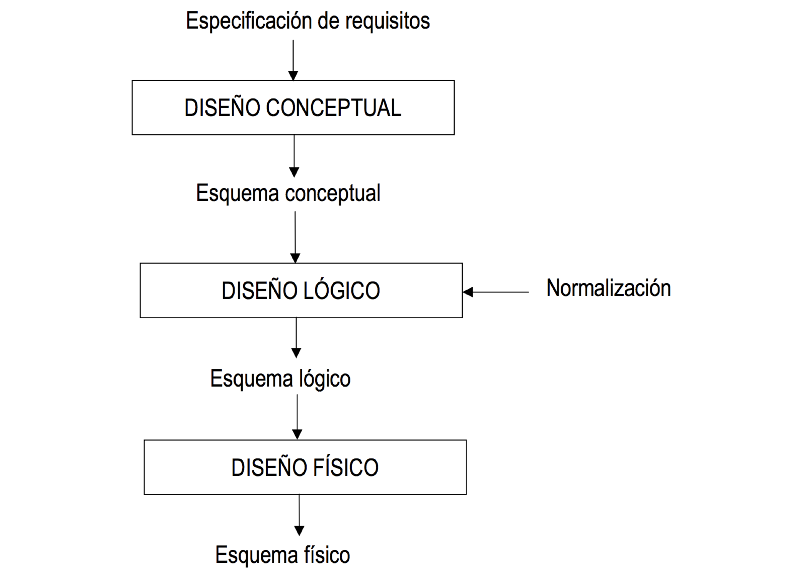
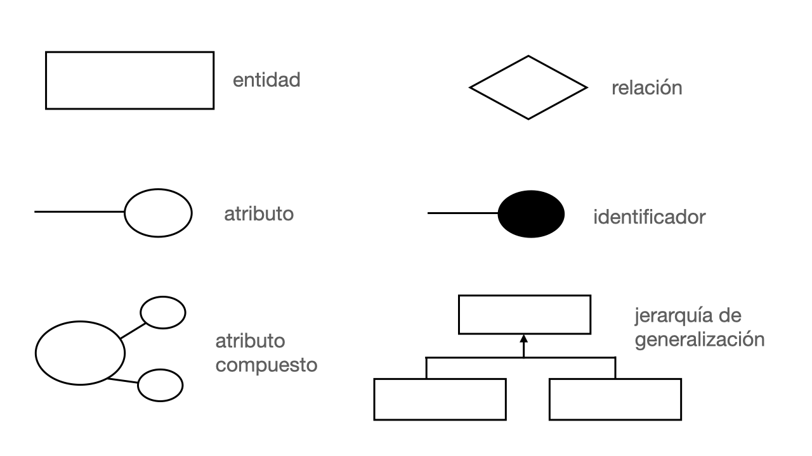
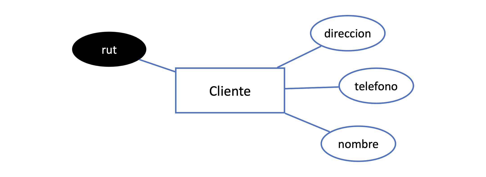
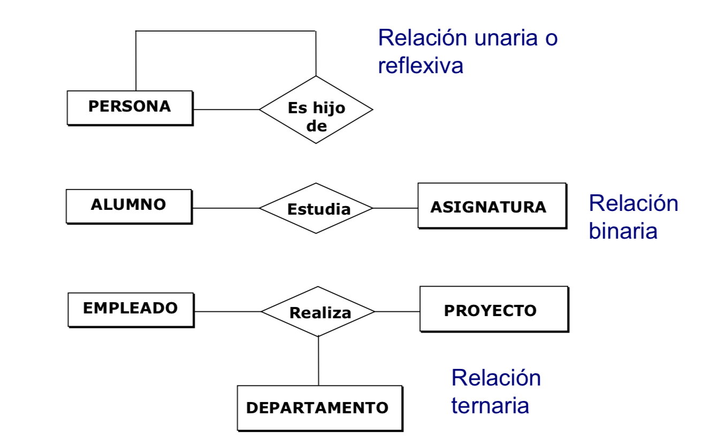
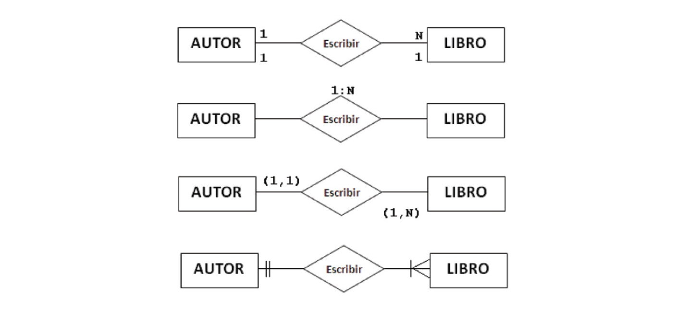
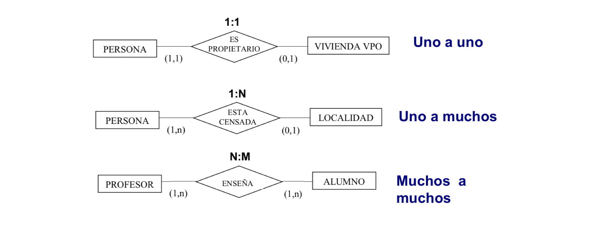
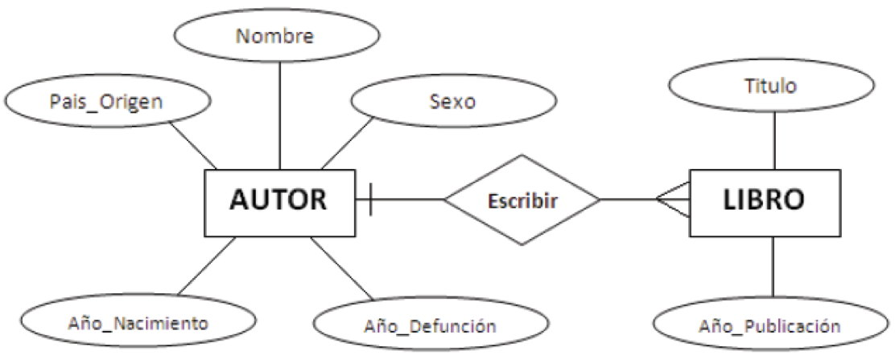
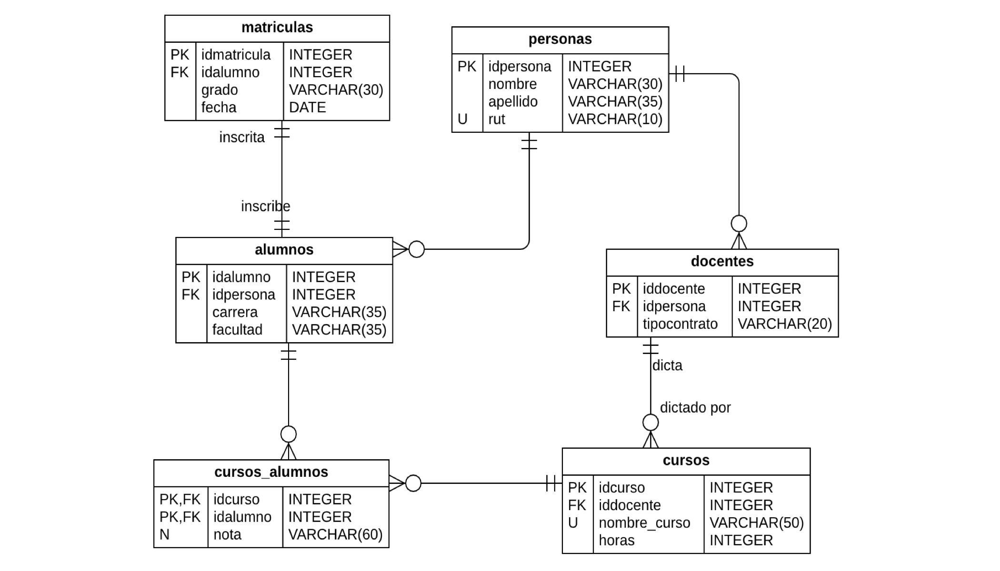

Al igual que los arquitectos realizan sus planos para construir casas, los diseñadores de base de datos necesitan realizar modelos para construir sus base de datos. Los modelos facilitan la comunicación entre el diseñador de base de datos y los usuarios finales[^1]. Los modelos son fáciles de utilizar y cambiar, ya que son sólo una imagen muy simplificada del sistema de información que se desea desarrollar.

[^1]: modelo conceptual de años anteriores, actualmente intervienen el CDO y otros profesionales

Actualmente en la participación de la construcción del modelo de datos se involucran muchos actores

**Conceptual**: esta fase incluye la identificación de las entidades del sistema y empresariales clave de nivel superior y sus relaciones, que definen el ámbito del problema que tratará el sistema. Estas entidades clave del sistema y empresariales se definen mediante la utilización de elementos de modelado del perfil UML para el modelado empresarial, incluidos los elementos del modelo de análisis empresarial y el modelo de clase de análisis del modelo de análisis.

**Lógica**: esta fase incluye el perfeccionamiento de las entidades del sistema y empresariales de alto nivel de la fase conceptual en entidades lógicas más detalladas. Estas entidades lógicas y sus relaciones se pueden definir, opcionalmente, en un modelo lógico de datos mediante la utilización de los elementos de modelado del perfil UML para el diseño de bases de datos, como se describe en la Directriz: Modelo de datos. Este modelo lógico de datos forma parte del Producto de trabajo: Modelo de datos.

**Física**: esta fase incluye la transformación de los diseños de la clase lógica en diseños de tablas de bases de datos físicas detalladas y optimizadas. La fase física también incluye la correlación de los diseños de tablas de base de datos con espacios de tablas y con el componente de base de datos en el diseño de almacenamiento de bases de datos.

## Modelo Entidad-relación (MER)

El Modelo Entidad Relación (MER) es una herramienta de modelado que fue introducido originalmente por Peter Chen[^2] en 1976 y aunque ha sufrido variaciones en cuanto a los elementos de diagramas utilizados para representar sus elementos, su operación y utilidad siguen aún vigentes. La base del MER está en identificar los elementos o entidades importantes del sistema, los datos (atributos) que componen cada uno de ellos y la interacción (o relación) entre dichos elementos.

[^2]: http://www.csc.lsu.edu/\~chen/chen.html

Es una metodología de diseño de Bases de Datos que consiste en representar a nivel conceptual los datos que soportan el funcionamiento de un sistema. Los componentes básicos de un MER son: Entidades, Atributos y Relaciones. Las entidades representan abstracciones con atributos que almacenan datos; las relaciones son las asociaciones que existen entre entidades y permiten generar información al combinar diferentes entidades.

**ENTIDAD**

Se denomina entidad a todo ente (conceptual o físico) del cual se desea establecer su participación dentro de un sistema de información. Una entidad concreta o física es aquella con existencia física, representa un objeto del mundo real (persona o elemento). Unaentidad abstracta no tiene una representación física concreta (posición laboral, asignatura).

**ATRIBUTO**

El atributo es elementos de información que caracteriza a una entidad, identificándola, calificándola, cuantificándola, o declarando su estado. Por lo general una entidad se compone de uno o más atributos (edad, genero, estatura, nombre, etc.). Los atributos permiten diferenciar elementos dentro de un conjunto de entidades. Dentro de una entidad de tipo persona es muy raro el caso que existan dos con exactamente los mismos atributos.

**RELACIONES**

Las relaciones identifican la interacción que existe entre dos o más entidades. Establecen el coportamiento del sistema de información.

### Diagrama Entidad relación

Los elementos básicos de MER se presentan en un diagrama simple que permite establecer en forma general un modelo de datos. Los elementos fundamentales se presentan en la Figura 4.2.

## Especificación de Requisitos

...

## Modelamiento Conceptual

Un modelo conceptual de datos identifica las relaciones de más alto nivel entre las diferentes entidades.

**Características**

- Incluye las entidades importantes y las relaciones entre ellas.
- No se especifica ningún atributo.
- No se especifica ninguna clave principal.

El requisito para un modelamiento exitoso pasa necesariamente por el "conocimiento del negocio", esto es, para lograr la meta de representar y organizar los datos para obtener la información que requiere el problema a resolver, se necesita un conocimiento cabal del problema.

No es igual modelar un sistema de inventario para un negocio de local único que para una cadena de tiendas, o para una clínica de salud. Siempe el modelo final va a estar supeditado a los requerimientos específicos del negocio.

Modelar significa en un modo amplio simplificar la realidad del negocio pero sin perder significancia de sus datos. Modelar implica **organizar** y **clasificar** la información en componentes simples que representen la información del negocio.

### Entidades

### Relaciónes

...

## Modelamiento Lógico

Un modelo de datos lógicos describe los datos con el mayor detalle posible, independientemente de cómo se implementarán físicamente en la base de datos.

**Características**

- Incluye todas las entidades y relaciones entre ellos.
- Todos los atributos para cada entidad están especificados.
- La clave principal para cada entidad está especificada.
- Se especifican las claves externas (claves que identifican la relación entre diferentes entidades).
- La normalización ocurre en este nivel.

**Etapas**

- Especifique claves primarias para todas las entidades.
- Encuentra las relaciones entre diferentes entidades.
- Encuentra todos los atributos para cada entidad.
- Resuelva las relaciones de muchos a muchos.
- Normalización.

### Cardinalidad

La **cardinalidad** esta definida como la cantidad de elementos en términos de proporción que participan en la **relación** entre dos o más **entidades**. Esta puede ser entre elementos únicos (unitarios) o múltiples.

Generalmente se utiliza la denominación "1" para elemntos unitarios, y "N" para varios elementos participantes.

Los diagramas siguientes expresan que "un autor escribe varios libros" o "un libro es escrito por un autor".

Las expresiones que pueden indicarse a partir de estos diagramas son:

- Un AUTOR escribe AL MENOS un LIBRO" (Cardinalidad mínima=1),
- Un AUTOR escribe VARIOS LIBROS" (Cardinalidad máxima = N),
- Un AUTOR escribe uno o varios LIBROS" (Cardinalidad mínima= 1, máxima =N)
- Un LIBRO es escrito por un y sólo un AUTOR" (Cardinalidad mínima y máxima = 1)

La FORMA de representar la CARDINALIDAD en un diagrama puede variar.

Algunos prefieren dejar escrito en el diagrama el mínimo y el máximo con números entre paréntesis, otros recomiendan escribir la Cardinalidad sobre la relación, mientras que otros recomiendan usar la notación de PATAS DE GALLO (CROW'S FEET), la cual es muy aceptada y usada por los software de diseño.

La cardinalidad representa el número máximo de ocurrencias de una entidad asociadas al número máximo de ocurrencias del resto de las entidades relacionadas.

Lo importante es ADOPTAR una nomenclatura y ser consecuente con ella. INDEPENDIENTE de la nomenclatura que se escoja, es imprescindible que en el diagrama se refleje la Cardinalidad mínima y máxima de las relaciones.

**NOTA**: Aunque son muy parecidos note que en la segunda versión del diagrama, la línea que une a las entidades cumple la función de denotar la cardinalidad mínima del modelo. En este caso al ser línea continua se entiende que la cardinalidad mínima es 1, si fuera una línea segmentada se entendería que la cardinalidad mínima es 0, es decir, una OPCIONALIDAD.

El diagrama ya está más completo, pero aún podemos mejorarlo agregando alguna información relevante de las entidades, como son, las características que los describen.

Tomemos los siguientes acuerdos para dibujar:

Usaremos un óvalo (o elipse) pare representar las características que describen, califican o clasifican a las entidades, es decir sus ATRIBUTOS (en general lo que nos "dice algo" o nos "aporta información" acerca de las entidades).

Dentro de cada óvalo irá el nombre de cada característica (de forma específica) Se unirá el atributo a la entidad con una línea simple.

### Claves Primarias

Las claves primarias son atributos que identifican de manera única a cada entidad. En el diagrama se representan con un subrayado.

### Claves Externas

Las claves externas son atributos que establecen una relación entre dos entidades. En el diagrama se representan con un subrayado y una línea que conecta la clave externa con la clave primaria de la entidad relacionada.

## Modelamiento Físico

El modelo de datos físicos representa cómo se construirá el modelo directamente en el motor de la base de datos. Un modelo de base de datos física muestra todas las estructuras de tablas, incluidos el nombre de cada columna, el tipo de datos de columna, las restricciones de columna, la clave principal, la clave externa y las relaciones que puedan darse entre las tablas.

**Características**

- Especificación de todas las tablas y columnas.
- Las claves externas se usan para identificar relaciones entre tablas.
- La desnormalización puede ocurrir según los requisitos del usuario.

**Etapas**

- Convertir entidades en tablas.
- Convertir relaciones en claves externas.
- Convertir atributos en columnas.
- Modificar el modelo de datos físicos en función de las restricciones / requisitos físicos.