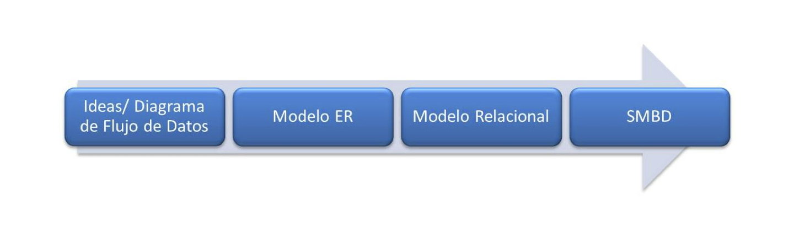
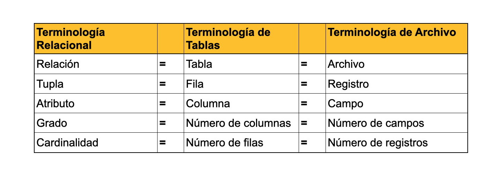
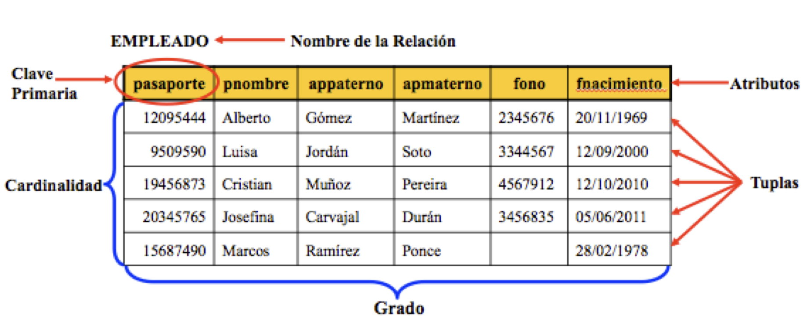
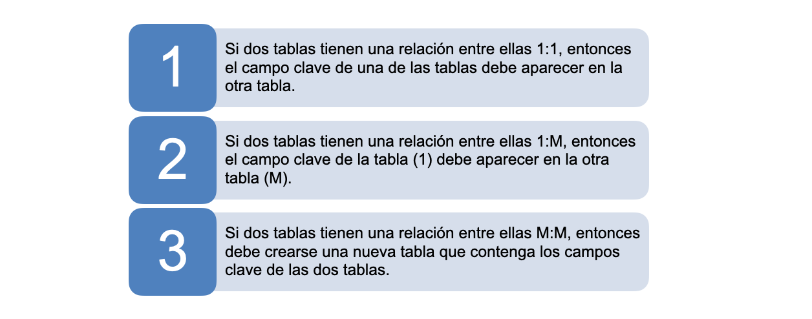
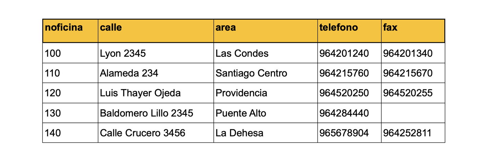
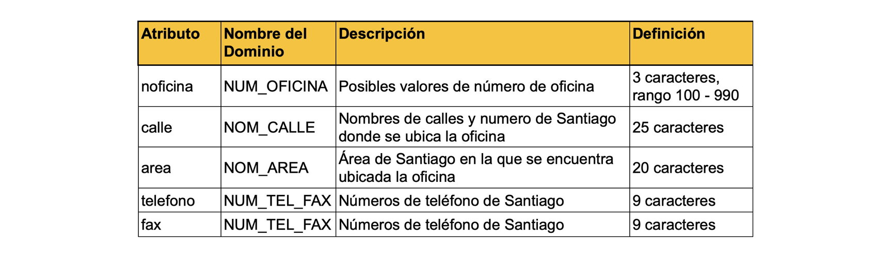
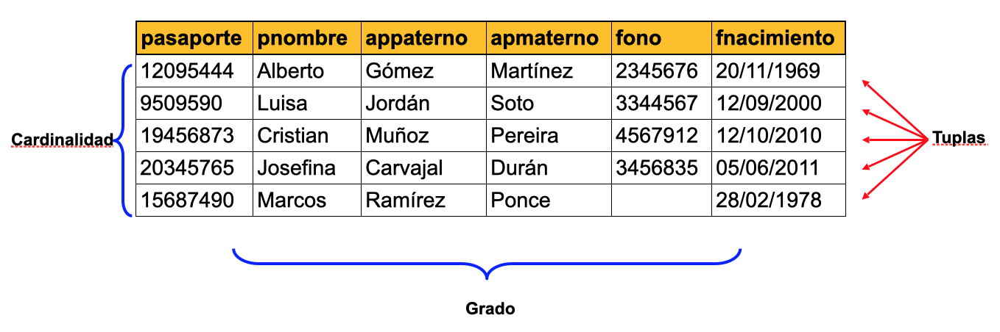

El modelo relacional, para el modelado y la gestión de bases de datos, es un modelo de datos basado en la lógica de predicados y en la teoría de conjuntos.

Tras ser postuladas sus bases en 1970 por Edgar Frank Codd, de los laboratorios IBM en San José (California), no tardó en consolidarse como un nuevo paradigma en los modelos de base de datos.

Su idea fundamental es el uso de relaciones. Estas relaciones podrían considerarse en forma lógica como conjuntos de datos llamados tuplas. Pese a que esta es la teoría de las bases de datos relacionales creadas por Codd, la mayoría de las veces se conceptualiza de una manera más fácil de imaginar, pensando en cada relación como si fuese una tabla que está compuesta por registros (cada fila de la tabla sería un registro o "tupla") y columnas (también llamadas "campos").

Es el modelo más utilizado en la actualidad para modelar problemas reales y administrar datos dinámicamente.

El modelo relacional desarrolla un esquema de base de datos (data base schema) a partir del cual se podrá realizar el modelo físico o de implementación en el DBMS.

Este modelo esta basado en que todos los datos están almacenados en tablas (entidades/relaciones) y cada una de estas es un conjunto de datos, por tanto una base de datos es un conjunto de relaciones. La agrupación se origina en la tabla: tabla -\> fila (tupla) -\> campo (atributo)

El Modelo Relacional se ocupa de:

-   La estructura de datos
-   La manipulación de datos
-   La integridad de los datos

Donde las relaciones estan formadas por :

-   Atributos (columnas)
-   Tuplas (Conjunto de filas)

Existen dos formas para la construcción de modelos relacionales:

-   Creando un conjunto de tablas iniciales y aplicando operaciones de normalización hasta conseguir el esquema más óptimo,
-   O, convertir el modelo entidad relación (ER) en tablas, con una depuración lógica y la aplicación de restricciones de integridad.

## Objetivos

Los objetivos que este modelo persigue son:

-   **Independencia Física**: La forma de almacenar los datos no debe influir en su manipulación. Si el almacenamiento físico cambia, los usuarios que acceden a esos datos no tienen que modificar sus aplicaciones.

-   **Independencia Lógica**: Las aplicaciones que utilizan la base de datos no deben ser modificadas por que se inserten, actualicen y eliminen datos.

-   **Flexibilidad**: En el sentido de poder presentar a cada usuario los datos de la forma en que éste prefiera.

-   **Uniformidad**: Las estructuras lógicas de los datos siempre tienen una única forma conceptual (las tablas), lo que facilita la creación y manipulación de la base de datos por parte de los usuarios.

-   **Sencilles**: Las características anteriores hacen que este Modelo sea fácil de comprender y de utilizar por parte del usuario final.

## Características

-   Los datos son atómicos ó monovaluados;
-   Los datos de cualquier columna son de un solo tipo.
-   Cada columna posee un nombre único.
-   El orden de las columnas no es de importancia para la tabla.
-   Las columnas de una relación se conocen como atributos.
-   Cada atributo tiene un dominio,
-   No existen 2 filas en la tabla que sean idénticas.
-   La información en las bases de datos son representados como datos explícitos.
-   Cada relación tiene un nombre específico y diferente al resto de las relaciones.
-   Los valores de los atributos son atómicos: en cada tupla, cada atributo (columna) toma un solo valor. Se dice que las relaciones están normalizadas.
-   El orden de los atributos no importa: los atributos no están ordenados.
-   Cada tupla es distinta de las demás: no hay tuplas duplicadas
-   El orden de las tuplas no importa: las tuplas no están ordenadas.
-   Los atributos son atómicos: en cada tupla, cada atributo (columna) toma un solo valor. Se dice que las relaciones están normalizadas.

## Definiciones

-   **Relación**: Tabla bidimensional para la representación de datos. Ejemplo: Estudiantes.

-   **Tuplas**: Filas de una relación que contiene valores para cada uno de los atributos (equivale a los registros). Ejemplo: 34563, José, Martinez, 19, Masculino. Representa un objeto único de datos implícitamente estructurados en una tabla. Un registro es un conjunto de campos que contienen los datos que pertenecen a una misma entidad.

-   **Atributos**: Columnas de una relación y describe las características particulares de cada campo. Ejemplo: id estudiante.

-   **Esquemas**: Forma de representar una relación y su conjunto de atributos. Ejemplo: Estudiantes (id estudiante, nombre(s), apellido(s), edad, género).

-   **Claves**: Campo cuyo valor es único para cada registro. Principal, identifica una tabla, y Foránea, clave principal de otra tabla relacionada. Ejemplo: id estudiante.

-   **Clave Primaria**: identificador único de una tupla.

-   **Cardinalidad**: número de tuplas(m).

-   **Grado**: número de atributos(n).

-   **Dominio**: colección de valores de los cuales el atributo obtiene su atributo.

 

## Reglas de Integridad

 

Reglas o restricciones de validación que controlan que los datos a registrar sean correctos.

-   **Integridad de Dominio**: Conjunto de valores válidos de un campo (propiedades del campo)
-   **Integridad de Transiciones**: Define los estados por lo que un registro puede pasar válidamente (operación previa)
-   **Integridad de Entidades**: Asegura la integridad de las tablas (claves, identificación)
-   **Integridad Referencial**: Mantienen y protegen vínculos entre tablas (propiedades de las relaciones)
-   **Integridad de Bases de Datos**: Referencian más de una tabla, gobiernan la DB como un todo.
-   **Integridad de Transacciones**: Controlan la forma como se manipulan los datos entre una o varias BD

## Atributo

Un Atributo en el Modelo Relacional representa una propiedad que posee esa Relación y equivale al atributo del Modelo E-R.

Se corresponde con la idea de campo o columna.

En el caso de que sean varios los atributos de una misma tabla, definidos sobre el mismo dominio, habrá que darles nombres distintos, ya que una tabla no puede tener dos atributos con el mismo nombre.

Por ejemplo, la información de las oficinas de una empresa inmobiliaria se representa mediante la relación OFICINA, que tiene columnas para los atributos noficina (número de oficina), calle, area, telefono y fax.

## Dominio

El dominio dentro de la estructura del Modelo Relacional es el **conjunto de valores que puede tomar un atributo**.

-   Un dominio contiene todos los posibles valores que puede tomar un determinado atributo. Dos atributos distintos pueden tener el mismo dominio.
-   Un domino es un **conjunto finito de valores del mismo tipo**.
-   Los dominios poseen un nombre para poder referirnos a él y así poder ser reutilizable en más de un atributo.

En el ejemplo, la tabla muestra los dominios de los atributos de la relación OFICINA. Nótese que en esta relación hay dos atributos que están definidos sobre el mismo dominio, teléfono y fax.

## Tupla, Grado y Cardinalidad

 **Tupla**: es cada una de las filas de la relación. Representa por tanto el conjunto de cada elemento individual (ejemplar ó ocurrencia) de esa tabla. En la relación OFICINA, cada tupla tiene cinco valores, uno para cada atributo. Las tuplas de una relación no siguen ningún orden.

**Grado**: número de columnas de la relación (número de atributos). La relación OFICINA es de grado seis porque tiene seis atributos. Esto quiere decir que cada fila de la tabla es una tupla con seis valores.

**Cardinalidad**: número de tuplas de una relación (número de filas). Ya que en las relaciones se van insertando y borrando tuplas a menudo, la cardinalidad de las mismas varía constantemente.

## Claves

Ya que en una relación no hay tuplas repetidas, éstas se pueden distinguir unas de otras, es decir, se pueden identificar de modo único. La forma de identificarlas es mediante los valores de sus atributos.

**Clave candidata**

Conjunto de atributos que permiten identificar en forma única cada tupla de la relación. Es decir columnas cuyos valores no se repiten para esa tabla. Los atributos candidatos para una tabla de individuos (clientes, pacientes, etc.) es el 'rut', un número de seguro social, un 'id' de cliente (numérico o de caracter).

**Clave primaria**

Clave candidata que se escoge como identificador de las tuplas. Se elige como primaria la candidata que identifique mejor a cada tupla en el contexto de la base de datos. Por ejemplo un atributo con el RUT sería clave candidata de una tabla de clientes, aunque si en esa relación existe un atributo de código de cliente, este sería mejor candidato para clave principal, porque es mejor identificador para ese contexto.

**Clave alternativa**

Cualquier clave candidata que no sea primaria y que también puede identificar de manera única una tupla. Al momento de crear la relación como tabla en la Base de Datos se debe definir una constraints de tipo UNIQUE.

**Clave externa, ajena o foránea**

Atributo cuyos valores coinciden con una clave candidata (normalmente primaria) de otra tabla.

## Discusión

¿Cómo se define Entidad y su representación en el Modelo Entidad Relación?

Identificar las Entidades a partir de las narrativas del usuario es la esencia para una gestión eficiente de datos.

¿Qué es un atributo de una Entidad?

El 'RUT' en particular puede ser utilizado en **uno** de varios dominios ya que puede ser tratado ya sea como numérico o de caracter. ¿de qué depende la elección?

