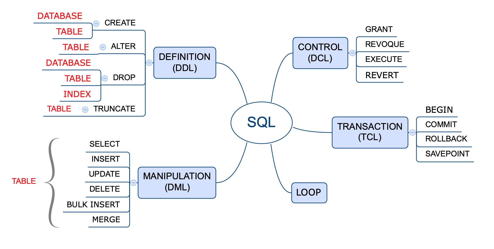

SQL es un lenguaje estructurado de consulta (Structured Query Language, en inglés). diseñado específicamente para administrar información en sistemas de gestión de bases de datos de tipo relacional.

Puede considerarse un lenguaje de programación como tal, ya que cuenta con uso de variables, tipos de datos, elementos condicionales y lógicos. Es el estandar de facto para la gestión de datos y permite:

- Consultar, actualizar y reorganizar datos
- Crear y modificar la estructura de datos
- Controlar el acceso a los datos

El uso de este lenguaje es altamente imperativo para todo profesional que tenga por objetivo acceder a altos volúmenes y/o datos complejos.

- [SQL tutorial](https://www.w3schools.com/sql/)

La historia de SQL se origina en 1970 en un paper del Dr. E. F. Codd de los laboratorios de investigación de IBM, titulado "A Relational Model of Data for Large Shared Data Banks" donde propuso la representación de un modelo de datos como un conjunto de tablas. Y la vinculación entre ellas mediante relaciones, lo que se conoce actualmente como el modelo relacional.

Junto con lo anterior, también propuso un lenguaje llamado **DSL/Alpha** para manipular los datos en las tablas relacionadas. En los laboratorios de IBM crearon sobre este un lenguaje simplificado que denominaron SQUARE. Modificaciones posteriores derivaron en uno llamado **SEQUEL** cuyo nombre finalmente se acortó a **SQL**. Finalmente se transformó en un estándar de la industria en 1986 por la ANSI (American National Standards Institute), y ya lleva más de 40 años de uso con numerosas características añadidas desde entonces.

Las últimas actualizaciones en 2016 agregan nuevas características como la integración de tecnologías como XML y JSON, y la búsqueda de filas en base a un patrón definido por una expresión regular.

El núcleo central de SQL se utiliza en la gran mayoría de las bases de datos comerciales y de uso gratuito. Algunas compañías han realizado ajustes a SQL para adaptarlas de mejor manera a sus productos y originado por tanto versiones "mejoradas" de SQL, como ejemplo de ello PL/SQL de Oracle y Transact-SQL de Microsoft.

**SQL** no es un acrónimo como se cree de **S**tandard **Q**uery **L**anguage (en español "lenguaje estándar de consulta"), es mas bien un cortamiento de la palabra SEQUEL y es el lenguaje estandarizado para la realización de consultas, es decir la extracción de datos desde las bases de datos. Es estándar ya que se utiliza en la totalidad de las bases conocidas, ya sea en forma nativa o en alguna variante según el fabricante de la base de datos.

Este no es un lenguaje de programación propiamente tal, como lo son PHP, Python, Java o Javascript, por mencionar unos pocos. Esto debido a que presenta ciertas limitaciones. Este lenguaje define tanto los inputs como los outputs que son ejecutadas por el motor de optimización de la base de datos.

Un ejemplo de SQL en el siguiente bloque de código:


```sql showLineNumbers
SELECT nombre, apellido, rut, edad, genero
FROM clientes
WHERE edad > 20 AND genero = 'M'
ORDER BY edad ASC
```

Donde: **SELECT** permite elegir que campos (o columnas como nombre, apellido, rut, edad y genero) queremos mostrar, **FROM** nos indica desde que tabla (clientes) y donde están definidos los campos. **WHERE** permite especificar una condición (o filtro que queremos ejecutar sobre los datos resultantes) y **ORDER BY** nos permite obtener una lista ordenada por edad en forma ascendente.

Por tanto, el código anterior obtendrá una lista de los clientes mayores de 20 años de género masculino y entregará los resultados en forma ordenada de menor a mayor edad. La lista contendrá las variables de nombre, apellido, rut, edad y género en ese mismo orden.

SQL posee entornos específicos de uso. Posee funciones para la definición de las bases de datos (DDL), el control de acceso de usuarios (DCL), la gestión de las transacciones (TCL) y el más importante o más utilizados la manipulación de datos (DML) que posee las funciones para la obtención de los datos propiamente tal.



## Tipos de Datos


Los tipos de datos soportados lo son por la mayoría de los sistemas de bases de datos que soportan SQL, salvo algunas excepciones que son particulares a un sistema específico. Tomar en cuenta que PostgreSQL utiliza adicionalmente tipos geométricos y direcciones de redes.

Tipos de datos en PostgreSQL: https://www.postgresql.org/docs/13/datatype.html

En general los tipos de datos manejados por SQL incluyen:

- Numéricos
- Moneda
- Caracter
- Binario
- Fecha/hora
- Lógicos (booleanos)
- Enumerados
- Geometricos
- Redes
- Bit String
- Texto
- UUID
- XML
- JSON
- Arreglos
- Compuestos (Composite)
- Rangos
- Identificadores de objetos

```sql showLineNumbers
SELECT CAST(12345.12 AS NUMERIC(10,5)) --returns 12345.12000
```

**Numéricos**

Los de tipo numéricos incluyen enteros y decimales con un almacenamiento desde -32768 a +32767 para "*smallint*", hasta +9223372036854775807 para un "*bigint*"

**Serial**

Los tipos serial (`serial, smallserial, bigserial` no son tipos efectivos sino una convención para anotar un identificador único auto incrementado). Se usa AUTO_INCREMENT en otras bases de datos.

```sql showLineNumbers
CREATE TABLE person (
    id SERIAL
)
```

***Char y varchar***

```sql showLineNumbers
CHARACTER VARYING(n), VARCHAR(n)
CHARACTER (n), CHAR(n)

SELECT CAST('ABC' AS CHAR(10)) 
-- 'ABC ' se completa con espacios a la izquierda
SELECT CAST('ABC' AS VARCHAR(10)) 
-- 'ABC' sin espacios
SELECT CAST('ABCDEFGHIJKLMNOPQRSTUVWXYZ' AS CHAR(10)) 
-- 'ABCDEFGHIJ' se trunca a 10 caracteres
```

***Arrays***

```sql showLineNumbers
-- declarando un arreglo
SELECT INTEGER[];
SELECT INTEGER[3]; 
SELECT INTEGER[][]; 
SELECT INTEGER[3][3]; 
SELECT INTEGER ARRAY; 
SELECT INTEGER ARRAY[3];

-- creando un arreglo

SELECT '{0,1,2}';
SELECT '{{0,1},{1,2}}';
SELECT ARRAY[0,1,2];
SELECT ARRAY[ARRAY[0,1],ARRAY[1,2]];
```

